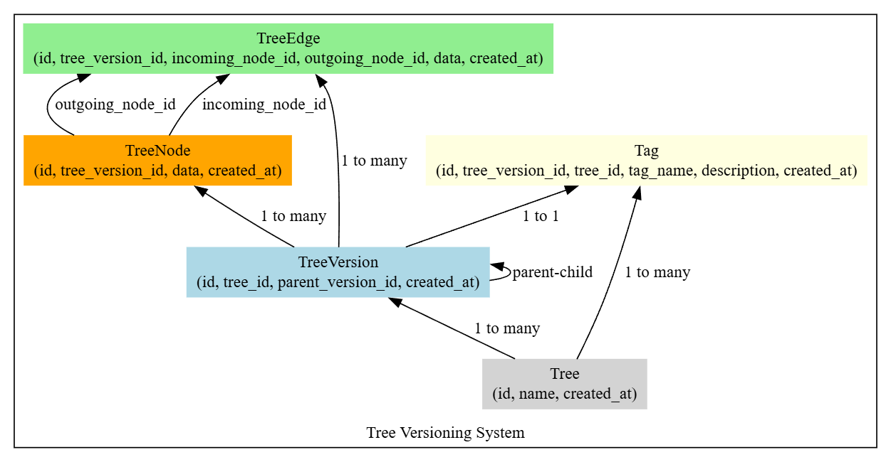

# KastleTreeVersioningSystem
The system built here is a tree versioning and configuration management tool that allows users to manage hierarchical data structures (trees) with version control and tagging capabilities. Users interact with a single Tree class to create trees, add nodes and edges, tag specific configurations, and create new tree versions from existing tags. Internally, the system tracks versions using a TreeVersion class, enabling cloning, rollback, and branching. Each version can have its own set of nodes (TreeNode) and edges (TreeEdge). 

The design ensures efficient management of tree structures over time, supporting configuration snapshots, experimental branches, and safe rollbacks. A comprehensive test suite validates key operations, ensuring the system performs as expected in creating, modifying, and restoring tree configurations.

## Quick Overview Video

[](https://youtu.be/aFu_srCWaG8)


## Table of Contents
1. [Database Implementation](#database-implementation)
    - [Models](#models)
    - [Migrations](#migration-scripts)
    - [Indexing](#efficient-indexing)
2. [Testing](#testing)
    - [Integration and Unit Tests](#running-integration-and-unit-tests)
    - [Running main](#running-main)
3. [Documentation](#documentation)
    - [Installation and Setup](#installation-and-setup)
    - [Design Decisions and Tradeoffs](#design-decisions-and-tradeoffs)
    - [Example Use Cases](#example-use-cases)


  
[License](#license)

[Contact](#contact)

## Database Implementation

### Models
There are 5 models/classes used to build this system. 



#### **Tree**  
Represents the **root object** or logical container for versioned configurations. Each `Tree` can have multiple versions (snapshots) over time, allowing branching, tagging, and rollback of hierarchical data.


#### **TreeVersion**  
Acts as a **snapshot or version** of a `Tree` at a specific point in time. Each `TreeVersion` can clone data from previous versions and stores the state of nodes and edges at that point, enabling version control and branching.


#### **Tag**  
A label or identifier linked to a specific `TreeVersion`. Tags provide **human-readable names** (e.g., `v1.0`, `stable-release`) for easy access to specific versions, facilitating rollback, retrieval, and branching.


#### **TreeNode**  
Represents an **individual node** within a `TreeVersion`. Nodes store configuration data or hierarchical information, forming the building blocks of the tree’s structure.


#### **TreeEdge**  
Defines **relationships** or **connections** between `TreeNode` objects within a `TreeVersion`. Edges can contain metadata (e.g., weights, types) and help represent parent-child or dependency relationships between nodes.  

These models collectively enable a **versioned, hierarchical data structure** with full support for branching, tagging, and rollback operations.

---

### Migration Scripts 
The migration scripts for all the schema changes can be found in the [migrations folder](migrations/). It contains all the versions of the schema used for the implementation of the Tree Versioning System. 

### Efficient Indexing
The most two most queried attributes/keya are **tree_version_id** in the tables : TreeVersion, TreeNode and TreeEdge and **tag_name** in the Tag Table. 

To improve access times an index was made on these attributes to speed up access. See [schema.sql](db/schema.sql) 

## Testing

Note: a key difference between the code in the initial take home prompt is that a Tree needs to be created first and then the call to get is made. Rest of the functions work as expected from here. 

```
----------NEW--------------            ----------OLD--------------
Tree.create("ExistingTree")      vs      tree = Tree.get(id=1)
tree = Tree.get(tree_id =1)            ---------------------------
---------------------------

```
### Running Integration and Unit Tests
The test framework used is pytest
```
# To Run Unit Tests
pytest .\tests\unit_tests.py -vv

# To Run Integration Tests
pytest .\tests\integration_tests.py -vv
```
### Running main

in the file [main.py](src/main.py) , you can add whatever functionality you wish to test the code in the main() function. 
```
python src.main
```
## Documentation

### Installation and Setup 
1. Clone Repository
```
git clone https://github.com/Veshek/KastleTreeVersioningSystem.git
cd KastleTreeVersioningSystem
```

1. Create a Virtual Environment for Clean Package Management
To set up a virtual environment for this project, run the following command inside the project directory:

```
python -m venv venv
```

2. Activating the Virtual Environment
```
On macOS/Linux:
source venv/bin/activate

On Windows:
venv\Scripts\activate
```

3. Install Dependencies
```
After activating the virtual environment, install the required dependencies:

pip install -r requirements.txt
```

### **Design Decisions and Tradeoffs**  
When implementing versioning systems, two common approaches are the **snapshot approach** and the **diff (delta) approach**. Each comes with its own tradeoffs:

---

#### **Snapshot Approach**  
- **Description**: Entire state of the tree is cloned and stored at each version.  
- **Pros**:  
  - Simple to implement and reason about.  
  - Fast reads – retrieving a version is direct and requires no reconstruction.  
  - Easier rollback and branching (just copy the whole state).  
- **Cons**:  
  - High storage cost – duplicates entire structures, even if changes are minimal.  
  - Can lead to performance issues if the tree is large and versions are frequent.  
  - Inefficient for systems with minor, incremental updates.  

---

#### **Diff (Delta) Approach**  
- **Description**: Only the differences (changes) between versions are stored.  
- **Pros**:  
  - Highly space-efficient – stores minimal data for each change.  
  - Ideal for large datasets with small, incremental modifications.  
  - Faster writes – only changes are appended.  
- **Cons**:  
  - Slower reads – reconstructing a version requires applying a chain of diffs.  
  - More complex to implement (tracking and applying diffs correctly).  
  - Rollbacks can be slower as diffs need to be reversed or reapplied.  

---

#### **Tradeoff Considerations**  
Given the time constraint of the task and the relative simplicity of implementing a snapshot approach, I decided to go with this approach. 
If time had permitted i would have attempted to track the differences across each version. This would have required traversing through the 
parent-child hierarchy in the version table to track which nodes belonged to which version.

### Example Use Cases

1. Version Control Systems (Ex: Git) 
   It is apparent that this structure can be used to track changes to files and folder version hierarchies where branching from particular versions could prove useful. The data structure would likely need to be adapted to accomodate the nature of file data and chunks but this Tree Versioning System is essentially the same concept the Version Control Systems are built on. 

2. Database Backups
   Such a structure could prove very useful in backing up data at different points in time. The snapshot approach would be particularly suited to this as all the data in each node would be captured at the respective instance in time.  
---

## License  
This project is licensed under the **MIT License** – see the [LICENSE](LICENSE) file for details.  

---

## Contact  
**Author**: [Keshav Gopinath](https://www.linkedin.com/in/keshav-gopinath/)  
**Email**: [keshavkarthikk@example.com](mailto:keshavkarthikk@gmail.com)  
**GitHub**: [https://github.com/Veshek](https://github.com/Veshek)  
**LinkedIn**: [https://linkedin.com/in/yourprofile](https://www.linkedin.com/in/keshav-gopinath/)  


